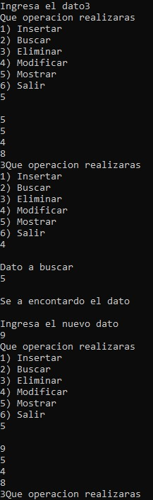

# Circular Doubly Linked List CRUD (Integer Values)

A console-based CRUD (Create, Read, Update, Delete) application implemented using a circular doubly linked list to manage integer values.

## Overview

This project demonstrates the implementation of a circular doubly linked list through an interactive console application.

The application performs CRUD operations on integer values while maintaining a circular doubly linked structure. It illustrates bidirectional traversal, dynamic memory allocation, and pointer manipulation in C.

The project was developed as an educational exercise to understand advanced linked data structures and their associated operations.

## Features

- Circular doubly linked list implementation.
- CRUD operations (Create, Read, Update, Delete).
- Integer value management.
- Bidirectional node traversal.
- Circular node connections.
- Dynamic memory allocation.
- Interactive console interface.

## Screenshot



## Technologies

- C
- Standard C Library
- Dev-C++

## Project Structure

```text
.
├── assets
│   └── images
│       └── circular_doubly_linked_list_crud_integers_demo.jpg
├── circular_doubly_linked_list_crud_integers.cpp
├── README.md
├── LICENSE
└── .gitignore
```

## How to Compile

Using GCC:

```bash
g++ circular_doubly_linked_list_crud_integers.cpp -o circular_doubly_linked_list_crud_integers
```

## How to Run

Windows

```bash
circular_doubly_linked_list_crud_integers.exe
```

Linux/macOS

```bash
./circular_doubly_linked_list_crud_integers
```

## Concepts Demonstrated

- Circular doubly linked lists
- CRUD operations
- Bidirectional traversal
- Dynamic memory allocation
- Pointer manipulation
- Circular data structures
- Menu-driven programming

## Future Improvements

- Prevent duplicate values.
- Add sorting algorithms.
- Save and load data from files.
- Improve input validation.
- Modularize the project into multiple source files.
- Release all allocated memory before program termination.

## License

This project is licensed under the MIT License.

## Author

Luis Alva
